# Dashboards en real-time y near real-time con Power BI

Power BI admite como origen de datos un dataset que se alimente en modo streaming. Esta secuencia de datos puede ser visualizada en dashboards en forma desatendida, es decir, sin necesidad de hacer refresco de los tiles.

## Resumen
Además de las series temporales, hay numerosos escenarios donde la posibilidad de contar con información en tiempo real o con unos pocos segundos de retardo es fundamental para la toma de decisiones.

En estas líneas se explicarán los conceptos y detalle de los pasos para realizar dashboards con Power BI en real-time y near real-time utilizando Azure Event Hubs y Azure Stream Analytics. Se provee una aplicación cliente para simular la generación de eventos masivos.

## Contexto
Las [arquitecturas lambda](https://en.wikipedia.org/wiki/Lambda_architecture) fueron concebidas para diferenciar información analítica y/o histórica (cold data, cold path, low speed, batch-processing, batch layer, etc.) de la información que requiere un tratamiento inmediato (hot data, hot path, high speed, stream-processing, speed layer, etc.)

A continuación se analiza un escenario genérico y se describen los pasos para implementar el hot path a través de las herramientas de [Azure Event Hub](https://azure.microsoft.com/en-us/services/event-hubs/), [Azure Stream Analytics](https://azure.microsoft.com/en-us/services/stream-analytics/) y [Power BI](https://powerbi.microsoft.com/en-us/what-is-power-bi/).

## Software y herramientas

* [Subscripción de Azure](https://azure.microsoft.com/es-es/free)
* [Visual Studio](https://www.visualstudio.com)
* [Azure Event Hub](https://azure.microsoft.com/en-us/services/event-hubs/)
* [Azure Stream Analytics](https://azure.microsoft.com/en-us/services/stream-analytics/)
* [Power BI](https://powerbi.microsoft.com/en-us/what-is-power-bi/)
* [Azure SQL Database](https://azure.microsoft.com/en-us/services/sql-database/) (opcional)

Este documento asume que el lector tiene conocimientos básicos de operación de Power BI.

>Tip. Para este tutorial se crearán recursos de Event Hubs y Stream Analytics utilizando el portal web de Azure, sin embargo cabe señalar que todos los recursos pueden ser creados utilizando línea de comandos a través del [Azure CLI](https://docs.microsoft.com/en-us/cli/azure/install-azure-cli?view=azure-cli-latest)

## Fases del proyecto
Como parte del ciclo de vida de desarrollo del proyecto propio que se esté ejecutando es importante destacar dos fases que son convenientes tener en especial consideración.
* La gestión de requerimientos, para una adecuada evaluación de requisitos y resultados esperados (no toda información es posible ni conveniente desplegarla en tiempo real).
* El diseño de la arquitectura, que contemple los requisitos funcionales y los atributos de calidad o requerimientos no funcionales.

A continuación se desarrollan brevemente algunas recomendaciones y buenas prácticas sobre estas dos actividades.

## Gestión de requerimientos
Es importante hacer una consideración de alto nivel con respecto a los requisitos que son evaluados para la visualización de información en tiempo real. La necesidad de contar con datos actualizados no es condición necesaria para implementar una solución de streaming de datos. Muchas veces una solución de micro-batch es más adecuada si se precisan cálculos complejos, contrastes con datos históricos, cruces de información con múltiples orígenes de datos históricas, etc. **La visualización de dashboards en real-time está más asociada con los últimos datos más que con una fuente de datos actualizada.**

## Arquitectura de alto nivel
Como se mencionó anteriormente hablar de real-time o near real-time implica un modelo dinámico diseñado para tener en cuenta la menor latencia posible en el flujo de datos. Las técnicas y herramientas empleadas aquí siguen el flujo hot-path de una arquitectura [lambda](https://en.wikipedia.org/wiki/Lambda_architecture), tal como se describe a continuación.


## Ingestión y encolamiento
Azure Event Hubs es un servicio para la ingestión masiva de eventos, en este tutorial se empleará como vía de entrada para los datos. Event Hubs posee varias características interesantes para soportar múltiples escenarios de control de flujo, contextos de publicación-subscripción, etc. Más información [aquí](https://docs.microsoft.com/es-es/azure/event-hubs/event-hubs-what-is-event-hubs).

### Crear un Event Hub en Azure
>Tip. Antes de crear un Event Hub en una cuenta de Azure se recomienda primero crear un nuevo Resource Group separado alejado de entornos de test y/o producción.

Para crear un Event Hub primero se debe crear un Event Hubs Namespace que contiene múltiples instancias de Event Hubs. En el portal de Azure se debe buscar <i>"Event Hubs"</i> en la sección de <i>Create a resource</i>:


#### ¿Qué son Throughput Units?
Son las unidades de control/rendimiento de tráfico Event Hubs namespace. Cada unidad permite hasta 1MB de entrada y 2MB de salida y un namespace puede soportar hasta 20 unidades por defecto. Al momento de crear un nuevo namespace la opción de auto crecimiento está habilitada para que el namespace de Event Hubs incremente su número de unidades cuando se esté quedando corto de entrada/salida.
A falta de un método nativo de auto decrecimiento, se recomienda seguir los pasos sugeridos [en este post](http://tjaddison.com/2017/12/10/Auto-deflating-Event-Hubs-with-a-function-app.html) de un tercero.

>Nota. Para seguir el tutorial sólo será necesario crear un namespace con una unidad y sin auto crecimiento.

Para crear un Event Hub se ingresa al portal <b>Overview</b> de un Event Hubs namespace y se hace click en la parte superior izquierda donde se aprecia la opción <b>"+ Event Hub"</b>:


La creación de un Event Hub requiere 3 parámetros:
- Nombre del event hub
- Número de particiones
- Número de días de retención para los mensajes


#### ¿Qué son particiones en un Event Hub?
Son secuencias ordenadas de eventos dentro de un Event Hub. Están directamente relacionadas al número de lectores concurrentes que se planean para un Event Hub en particular y su cantidad se define únicamente al momento de crear dicho Event Hub. Nueva data entrante se reparte utilizando asignación de Round-Robin entre las particiones disponibles en el Event Hub y si bien se puede definir desde código fuente a que partición se desea escribir datos o leerlos, se recomienda que se mantenga el comportamiento de escritura y lectura de datos por default. En el portal de Azure se pueden definir hasta un máximo de 32 particiones por Event Hub, aunque se aclara que este número puede ser incrementado contactando a soporte.

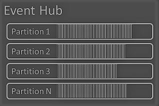

#### Días de retención de mensajes
Los mensajes (eventos enviados) de un Event Hub no pueden ser eliminados de manera directa si no que viven dentro del servicio de 1 a 7 días de acuerdo a la retención que se desee establecer. Por defecto, la política de retención de mensajes es de 1 día.

>Nota. Para seguir el tutorial sólo será necesario mantener los valores por defector de la creación de un Event Hub: 2 particiones y política de retención de mensajes de 1 día.

#### Consumer groups

Los <b>Consumer Groups</b> son vistas (estados, posiciones) de un Event Hub y son el mecanismo de consumo de los eventos dentro de dicho Event Hub. Mediante estos Consumer Groups múltiples aplicativos / servicios pueden consumir los eventos a su propio ritmo y de manera independientemente sin afectar al resto de aplicativos.
Por eso se recomienda que cada vez que se desea consumir los eventos de un Event Hub se debe crear un nuevo Consumer Group para esa tarea.
- Cada Consumer Group puede soportar hasta 5 lectores dentro de una partición. 
- Un Event Hub tiene siempre un Consumer Group por defecto y puede tener hasta 20 en la capa Standard

> Nota. Para seguir el tutorial se creará un Consumer Group que será consumido desde el servicio de Stream Analytics


### Generador aleatorio de eventos ###
Típicamente los eventos son generados por dispositivos o aplicaciones en forma independiente a través del tiempo. Para imitar este flujo de datos se incluye el código fuente de un emulador de eventos con el que se puede completar el ejercicio de visualización en real-time [(ver carpeta EventHubSender](https://github.com/CSELATAM/Real-time-y-near-real-time-dashboards-con-Power-BI/tree/master/EventHubSender) para el código fuente completo).

Se generan datos aleatorios simulando una embarcación que navega en altamar con los siguientes atributos:
- Temperatura de 4 bodegas (valores numéricos que van de 15 - 20)
- Velocidad de barco (valores numéricos que van de 80-120)
- Latitud y longitud del barco (valores numéricos que representan una posición en el mar Caribe cerca a Cartagena, Colombia)
- Tiempo general, hora, minuto y segundo en el que se envían los datos
- ID de barco (valores numéricos que van de 1-5)

#### Código fuente ####
El proyecto de consola hecho en C# cumple con la premisa de que se envíen N eventos generados cada M milisegundos y funciona toda vez que una cadena de conexión a un EventHub Namespace y el nombre de un EventHub que exista dentro de ese Namespace hayan sido definidos en el archivo <b>App.Config</b>:

```xml
<?xml version="1.0" encoding="utf-8" ?>
<configuration>
  <appSettings>
    <add key="eventHubNameSpaceConnectionString" value="yourEventHubNamespaceConnectionString" />
    <add key="eventHubName" value="yourEventHubName" />
  </appSettings>
</configuration>
```
##### Cadena de conexión
Para obtenerla se debe acceder al portal del Event Hubs Namespace e ingresar en la opción <b>"Shared Access Policies"</b> dentro de la sección <b>Settings</b> en el menú vertical del lado izquierdo del portal:


Dentro de la sección de Shared Access Policies se encuentra ya una política por defecto llamada <b>RootManageSharedAccessKey</b> que contiene llaves y cadenas de conexión primarias y secundarias:


>Nota. Para seguir el tutorial es suficiente utilizar la cadena de conexión primaria de esta política definida por defecto. Sin embargo se recomienda crear una política diferente con los respectivos permisos de lectura y/o escritura para el escenario sobre el cual se desee trabajar.

##### Nombre de Event Hub
El nombre del Event Hub a utilizarse se encuentra en la opción <b>Event Hubs</b> de la sección <b>Entities</b> del mismo portal del Event Hubs namespace:


El código fuente del emulador de eventos cuenta con sólo un archivo <b>Program.cs</b> que contiene toda la lógica. Se cuentan con 4 atributos principales:
- Número de eventos a enviar
- Milisegundos que deben pasar entre cada evento
- Cadena de conexión de un EventHub Namespace
- Nombre de un Event Hub

```csharp
class Program
{
    public static int eventsToSend;
    public static int milisecondsBetweenEvents;
    public static string eventHubConnString = ConfigurationManager.AppSettings["eventHubNameSpaceConnectionString"];
    public static string eventHubEntityPath = ConfigurationManager.AppSettings["eventHubName"];
}
```

El método principal consta de 3 líneas de código en las que se definen el número de eventos, milisegundos entre eventos y llamada al método <b>SendEvents()</b> que se encarga de mandar datos al servicio de EventHub:
```csharp
static void Main(string[] args)
{
    milisecondsBetweenEvents = 1000;
    eventsToSend = 20;
    SendEvents().GetAwaiter().GetResult();
}
```

El método <b>SendEvents</b> está compuesto de 3 partes diferenciadas:
- Un constructor de cliente de EventHub
- Una llamada al método <b>PrepareRandomData</b> que genera datos aleatorios
- El envío de dichos datos generados a EventHub
```csharp
private static async Task SendEvents()
{
    var connectionStringBuilder = new EventHubsConnectionStringBuilder(eventHubConnString)
    {
        EntityPath = eventHubEntityPath
    };
    client = EventHubClient.CreateFromConnectionString(connectionStringBuilder.ToString());

    Random ran = new Random();
    for (int i = 0; i<eventsToSend; i++)
    {
        string randomData = PrepareRandomData(ran);
        try
        {
            await client.SendAsync(new EventData(Encoding.UTF8.GetBytes(randomData)));
        }
        catch (Exception ex)
        {
            Console.WriteLine($"{DateTime.Now} - Exception: {ex.ToString()}");
        }
        await Task.Delay(milisecondsBetweenEvents);
    }
    await client.CloseAsync();
}
```

Finalmente, el metodo <b>PrepareRandomData</b> genera los datos de temperatura, latitud, longitud, tiempo y ID para un barco ficticio y devuelve una cadena con formato JSON:
```csharp
private static string PrepareRandomData(Random ran)
{
    #region Latitude and Longitude generator
    double lat = ran.NextDouble() - 10.5;
    double lon = ran.NextDouble() - 76;
    string latString = lat.ToString();
    latString = latString.Replace(',', '.');
    latString = latString.Substring(0, 7);
    string lonString = lon.ToString();
    lonString = lonString.Replace(',', '.');
    lonString = lonString.Substring(0, 7);
    #endregion

    var message = $"{{" +
        $"\"IdentidadBarco\": {ran.Next(1, 5)}," +
        $"\"TemperaturaBodega1\": {ran.Next(15, 20)}," +
        $"\"TemperaturaBodega2\": {ran.Next(15, 20)}," +
        $"\"TemperaturaBodega3\": {ran.Next(15, 20)}," +
        $"\"TemperaturaBodega4\": {ran.Next(15, 20)}," +
        $"\"VelocidadBarco\": {ran.Next(80, 120)}," +
        $"\"Latitud\": {latString}," +
        $"\"Longitud\": {lonString}," +
        $"\"Hora\": {DateTime.UtcNow.Hour}," +
        $"\"Minuto\": {DateTime.UtcNow.Minute}," +
        $"\"Segundo\": {DateTime.UtcNow.Second}," +
        $"\"Tiempo\": \"{DateTime.UtcNow.TimeOfDay}\"" +
        $"}}";
    return message;
}
```

## Análisis de streaming de datos
Ahora que se cuentan con datos generados listos para ser consumidos desde Event Hub se procede a consumirlos desde el servicio de Stream Analytics.

### Azure Stream Analytics
Es un servicio de procesamiento de eventos en tiempo real sobre datos de streaming que, además, permite aplicar cálculos o modificaciones a los eventos entrantes. En el diagrama de arquitectura presentado anteriormente puede verse su rol en el conjunto del proceso.

Por dentro, Stream Analytics está compuesto por múltiples componentes de entre los cuales se cuentan con 3 principales:

- Entradas de datos (Inputs)
- Sección de consulta de datos (Query)
- Salidas de datos (Outputs)

>Nota. Para este tutorial se tiene a Event Hub como entrada de datos y Power BI como salida de datos mientras que en la sección de consulta/modificacion de datos no se hace ninguna alteración.

Para más información [consulte la documentación oficial](https://docs.microsoft.com/es-es/azure/stream-analytics/stream-analytics-introduction).

### Creación del servicio de Azure Stream Analytics
En el portal de Azure se debe buscar "Stream Analytics" en la sección <b>Create a resource</b>:

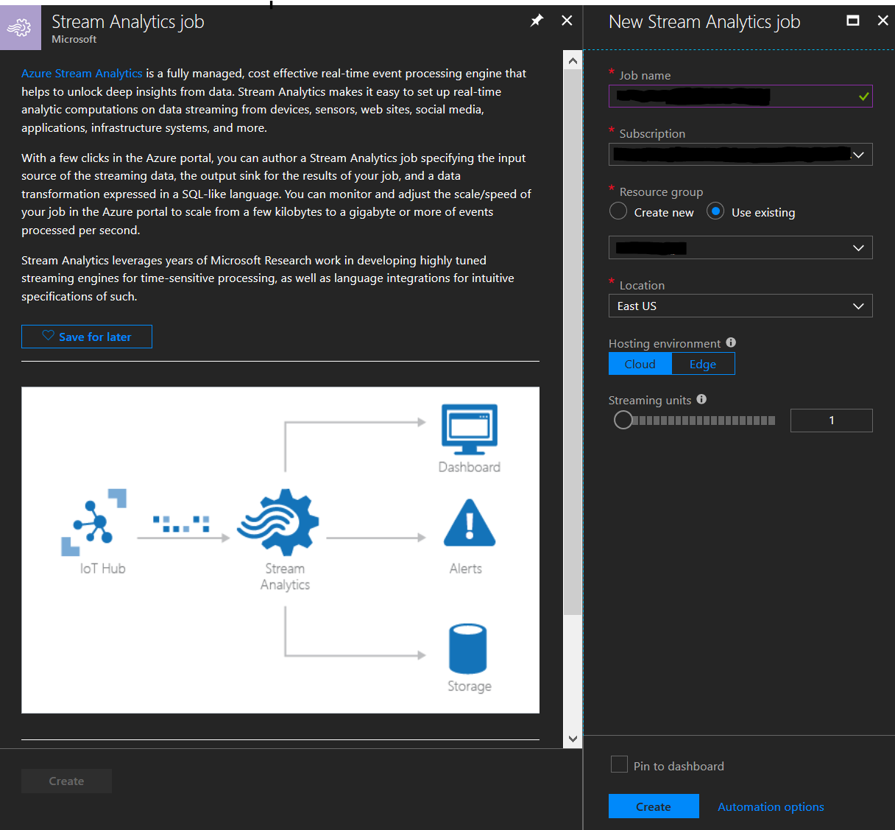

#### ¿Qué son Streaming Units?
Son la representancion de unidades de cómputo consumidas cuando se ejecuta una tarea. En esencia, un Streaming Unit es la manera relativa de medir la mezcla de memoria RAM, CPU y capacidad de lectura - escritura consumida por una tarea. Para más informacion consulte la [documentación oficial de Streaming Units](https://docs.microsoft.com/es-es/azure/stream-analytics/stream-analytics-streaming-unit-consumption).

>Nota. Para el tutorial se creará un servicio de Stream Analytics con sólo 1 Streaming Unit en el mismo grupo de recursos en el que se creó el namespace de Event Hubs.

Una vez creado el servicio se aprecia el siguiente portal desde donde se configurarán las entradas, consultas y salidas (En la seccion <b>Job Topology</b> del menú vertical izquierdo:

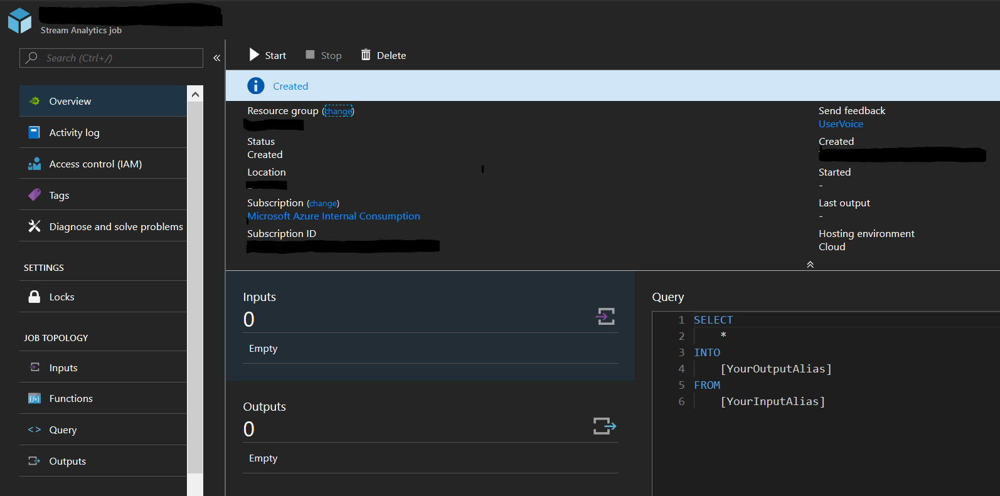

#### Configuracion de entradas
El tutorial cuenta con sólo una entrada de datos: el Event Hub que se creó en pasos anteriores y que ya tiene datos. Para configurar esta entrada es necesario agregar una nueva entrada de tipo Streaming:

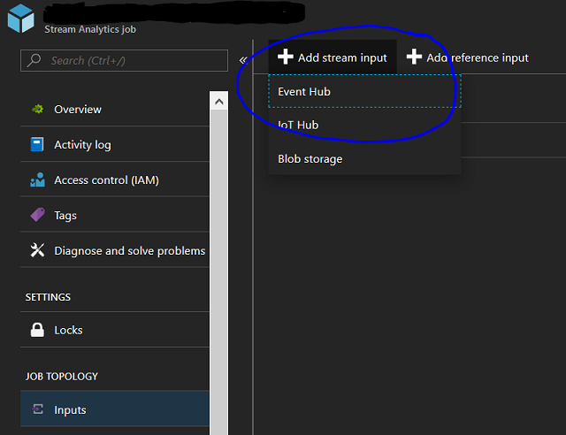

Más allá de proveer un alias para la nueva entrada da datos, el portal de Azure auto completa todos los otros campos necesarios cuando se agrega un Event Hub ya definido en la misma suscripción. El único campo no auto completado es el nombre del Consumer Group que se desea utilizar como entrada de datos:

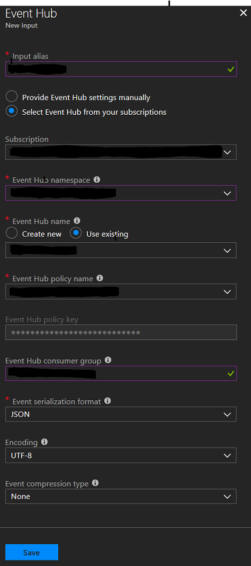

>IMPORTANTE. No olvidar incluir el nombre del Consumer Group creado para esta tarea específica porque de otra manera se utilizará el Consumer Group creado por defecto en el Event Hub y ésta no es una buena práctica pensando en que se desea que el servicio de Event Hub sea escalable para ser utilizado por otros servicios.

#### Configuración de salidas
Muy similar a la configuración de entradas. Se debe ingresar a la sección de <b>Outputs</b> en <b>Job Topology</b> y, al momento de definir una nueva salida, de debe seleccionar <b>Power BI</b>:

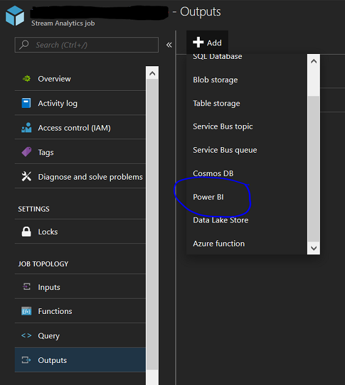

Para agregar una table de Power BI como salida es necesario autenticarse contra el servicio de Power BI utilizando el boton <b>Authorize</b>. Una vez se realize la autenticacion se podra seleccionar un Workspace dentro de la suscripcion y definir un dataset y tabla nuevos para volcar toda la data llegando a Stream Analytics desde las diferentes entradas:

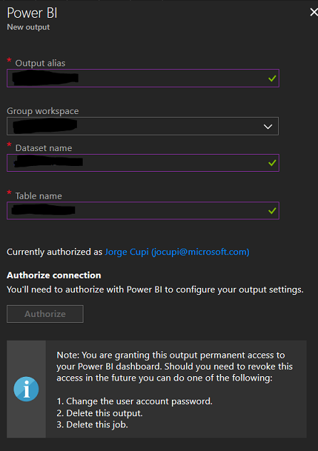

#### Configuracion de consultas
Finalmente se debe configurara la consulta que para el caso del tutorial solo agarra toda la data entrante y la vuelca en unica salida:

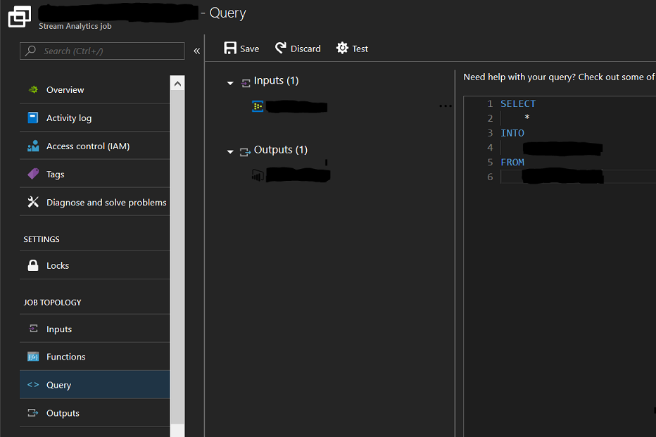

>Nota. Las capacidades de consulta de Stream Analytics van mas alla de solo agarrar data entrante y volcarla en multiples salidas. Para mas informacion sobre como modificar data entrante o decidir que datos saldran a diferentes servicios [se recomienda revisar la documentacion oficial de Querying en Stream Analytics](https://msdn.microsoft.com/en-us/azure/stream-analytics/reference/stream-analytics-query-language-reference).

## Visualización
La visualización de datos en real-time implica la mínima latencia posible, desde que el evento es producido hasta que es visualizado. Esta latencia es la suma de las latencias acumuladas en cada etapa: el tiempo de detección del evento en el productor, el tiempo de transferencia, el tiempo de encolamiento, el tiempo de procesamiento, el tiempo de envío e inserción en el dataset del dashboard y el tiempo de refresco en el mismo.

Normalmente las visualizaciones de Power BI requieren algún tipo de cálculo o procesamiento, por ejemplo, un diagrama de pie, necesita sumarizar campos por categorías y calcular los porcentajes de cada una para poder diagramarlos. La suma del esfuerzo de cada visualización puede ser muy costoso para un dashboard en términos de tiempo de procesamiento, por tanto, para tener una visualización actualizada en real-time, se han acotado la variedad de visualizaciones. Básicamente los tiles que se pueden agregar en real-time son visualizaciones simples de series temporales. El resto de las visualizaciones podrán ser empleadas con una frecuencia de actualización menor, que conocemos como near real-time.

### Real-time
En esta solución, la latencia acumulada entre el momento del encolamiento hasta el del refresco en el dasboard es del orden de los **2 segundos**.

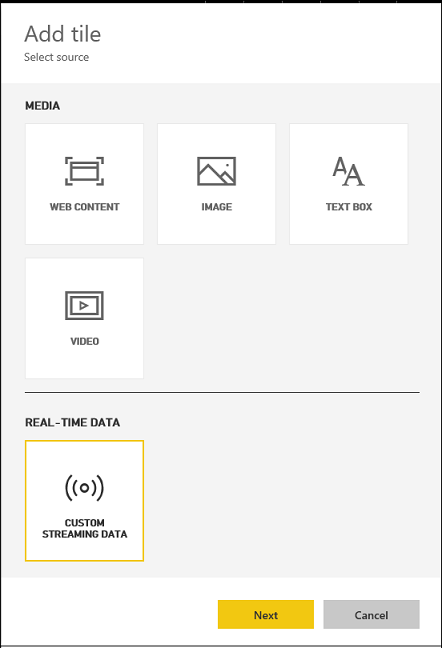

Seleccione el dataset definido previamente como output de Stream Analytics.

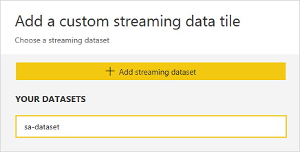

Seleccione el tipo de visualización y continue la configuración de acuerdo al mismo.

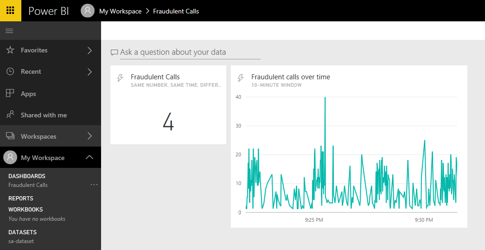

Estas visualizaciones se actualizan una vez por segundo.

### Near real-time
La latencia para la presentación de datos en near real-time va de entre los **5 y los 8 segundos** aproximadamente.

Una vez que Stream Analytics ha creado el dataset, éste puede ser utilizado en reportes convencionales empleando todos las visualizaciones disponibles. Notar sin embargo que los reportes no se refrescan automáticamente. Los reportes están concebidos para ser interactivos, es decir, para que el usuario realice operaciones de filtrado, drill down y búsquedas en forma manual. Para obtener un tile actualizado en near real-time éste debe ser anclado en un dashboard.

Para ello, marque el ícono de "Pin" en la visualización que desea exponer:

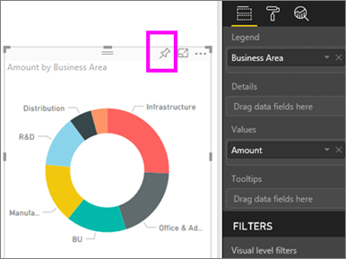

Indique un dashboard existente o cree uno nuevo en donde la visualización será publicada:


> Importante: si el dataset fue definido manualmente (y no a través de Stream Analytics), se debe activar la opción "Historic data analysis", en caso contrario no se podrán crear reportes con ese dataset.

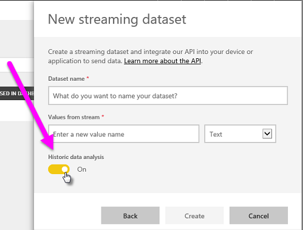

## Recomendaciones
* Hay mucha literatura referida a buenas prácticas de visualización de información y diseño de reportes y dashboards ([Aquí se pueden ver algunas recomendaciones](https://docs.microsoft.com/en-us/power-bi/power-bi-visualization-best-practices) concretas para Power BI). Además de los factores estéticos, volumétricos y conceptuales, con dashboards que muestran información muy dinámica es imperioso seleccionar cuidadosamente qué información es relevante mostrar y procurar reducirla al mínimo.
* Cuando se trata de streaming data hay otros recursos que pueden resultar más útiles que un dashboard, las alertas. Desde Stream Analytics se pueden generar alertas a través de aplicaciones, mensajes de correo o celular, etc. que pueden llamar la atención ante anomalías o superación de umbrales definidos por el negocio y que requieren una toma de decisiones rápida.
* Si bien en un dashboard de Power BI muchos tiles ofrecen la posibilidad de disparar alertas simples y personalizadas, el uso extendido de esta característica puede ser un indicador de que existen reglas de negocio que deben ser resueltas antes y -probablemente- sin necesidad de llegar a una solución de visualización.

## Referencias
* [Real-time streaming](https://docs.microsoft.com/en-us/power-bi/service-real-time-streaming)
* [Visualization best practices](https://docs.microsoft.com/en-us/power-bi/power-bi-visualization-best-practices)
* [Introudction to Azure Stream Analytics](https://docs.microsoft.com/es-es/azure/stream-analytics/stream-analytics-introduction)